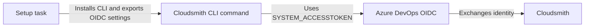

# Cloudsmith CLI for Azure DevOps

[](https://github.com/cloudsmith-io/cloudsmith-ado-integration/actions/workflows/ci.yml)
[](https://marketplace.visualstudio.com/items?itemName=Cloudsmith.CloudsmithCliSetupAndAuthenticate)
[](https://github.com/cloudsmith-io/cloudsmith-ado-integration/releases)
[](LICENSE)

Install the standalone [Cloudsmith CLI](https://github.com/cloudsmith-io/cloudsmith-cli), add it to `PATH`, and configure authentication for the rest of an Azure Pipelines job. The installed CLI does not require Python or pip on the agent.

[Quick start](#quick-start) · [Configuration](#configuration) · [Outputs](#outputs) · [Migration guide](#migrating-from-1-to-2) · [Contributing](#contributing)

## At a glance

| Capability | Support |
| --- | --- |
| Authentication | OpenID Connect (OIDC) or API key |
| Agents | Linux, macOS, and Windows |
| Architectures | x86-64, plus Linux and macOS ARM64 |
| CLI dependencies | None; the task installs the standalone CLI binary |
| Version selection | Latest release or a specific CLI version |

## Quick start

### Authenticate with OIDC

OIDC is the recommended option for CI/CD because it uses short-lived credentials instead of a stored API key. Configure a [Cloudsmith OIDC provider](https://docs.cloudsmith.com/authentication/openid-connect) for your Azure DevOps organization with the audience `api://AzureADTokenExchange` before using this example.

> [!IMPORTANT]
> Map `SYSTEM_ACCESSTOKEN` on the setup task and every later step that runs an authenticated `cloudsmith` command. `System.AccessToken` is the short-lived, job-scoped OAuth token created by Azure DevOps; it is not a personal access token (PAT) that you create or store. Azure Pipelines does not automatically expose secret variables to task processes.

```yaml
steps:
  - task: CloudsmithCliSetupAndAuthenticate@2
    displayName: Set up Cloudsmith CLI
    inputs:
      authMethod: oidc
      oidcNamespace: YOUR-NAMESPACE
      oidcServiceSlug: YOUR-SERVICE-ACCOUNT
    env:
      SYSTEM_ACCESSTOKEN: $(System.AccessToken)

  - script: cloudsmith whoami
    env:
      SYSTEM_ACCESSTOKEN: $(System.AccessToken)
```

### Authenticate with an API key

Store the API key as a [secret pipeline variable](https://learn.microsoft.com/azure/devops/pipelines/process/set-secret-variables), then pass it to the task. For automated pipelines, use a [Cloudsmith service account](https://docs.cloudsmith.com/accounts-and-teams/service-accounts) rather than a personal API key.

```yaml
steps:
  - task: CloudsmithCliSetupAndAuthenticate@2
    displayName: Set up Cloudsmith CLI
    inputs:
      authMethod: apiKey
      apiKey: $(MY_CLOUDSMITH_API_KEY)

  - script: cloudsmith whoami
    env:
      CLOUDSMITH_API_KEY: $(CLOUDSMITH_API_KEY)
```

Personal API keys are available from [Cloudsmith API settings](https://cloudsmith.io/user/settings/api/).

## Authentication

Choose one of the following authentication methods:

| Method | Inputs | Credential handling | Best suited to |
| --- | --- | --- | --- |
| OIDC | `authMethod: oidc`, `oidcNamespace`, and `oidcServiceSlug` | The CLI exchanges the mapped Azure DevOps token on its first authenticated command | CI/CD pipelines |
| API key | `authMethod: apiKey` and `apiKey` | The task masks and exports the key as a secret pipeline variable | Pipelines that cannot use OIDC |

With OIDC, the task exports the service account context needed by the CLI. The Cloudsmith access token is requested only when the CLI first needs to authenticate and is not exposed as a task output.



Set `verifyAuth: true` to run `cloudsmith whoami` during setup and fail early if authentication is not configured correctly.

### Use the token with other tools

Set `exportAuthToken: true` when a tool other than the CLI needs the Cloudsmith credential, for example `docker login`, `npm`, or `pip`. The task runs `cloudsmith credential-helper generic` once and exports the result:

- `CLOUDSMITH_API_KEY` contains the token as a masked, secret variable. With OIDC, this is the exchanged Cloudsmith token.
- `CLOUDSMITH_USERNAME` contains the username that registry clients use with the token.

This input requires Cloudsmith CLI 1.21.0 or later. Map the secret variable into each step that uses it:

```yaml
steps:
  - task: CloudsmithCliSetupAndAuthenticate@2
    displayName: Set up Cloudsmith CLI
    inputs:
      authMethod: oidc
      oidcNamespace: YOUR-NAMESPACE
      oidcServiceSlug: YOUR-SERVICE-ACCOUNT
      exportAuthToken: true
    env:
      SYSTEM_ACCESSTOKEN: $(System.AccessToken)

  - script: echo "$CLOUDSMITH_API_KEY" | docker login docker.cloudsmith.io --username "$CLOUDSMITH_USERNAME" --password-stdin
    displayName: Log in to the Cloudsmith Docker registry
    env:
      CLOUDSMITH_API_KEY: $(CLOUDSMITH_API_KEY)
```

An OIDC token is short-lived. Use it in the same job, and run the setup task again in each job that needs a token.

## Configuration

Set `authMethod` to `oidc` or `apiKey`, then provide the inputs required by that method.

### Installation inputs

| Input | Description | Required | Default |
| --- | --- | --- | --- |
| `cliVersion` | CLI version to install, such as `1.20.0` | No | `latest` |
| `installDirectory` | Root directory for versioned CLI installations | No | Agent tools directory |
| `verifyAuth` | Run `cloudsmith whoami` after setup | No | `false` |
| `exportAuthToken` | Export the resolved token as `CLOUDSMITH_API_KEY` and its username as `CLOUDSMITH_USERNAME` | No | `false` |

### Authentication inputs

| Input | Description | Required | Default |
| --- | --- | --- | --- |
| `authMethod` | Authentication method: `oidc` or `apiKey` | Yes | `apiKey` |
| `apiKey` | Cloudsmith API key supplied through a secret pipeline variable | For API-key authentication | — |
| `oidcNamespace` | Cloudsmith organization or namespace | For OIDC authentication | — |
| `oidcServiceSlug` | Cloudsmith service account slug | For OIDC authentication | — |

## Outputs

Give the task a `name` to reference its output variables:

```yaml
steps:
  - task: CloudsmithCliSetupAndAuthenticate@2
    name: cloudsmithSetup
    inputs:
      authMethod: apiKey
      apiKey: $(MY_CLOUDSMITH_API_KEY)

  - script: echo "Installed Cloudsmith CLI $(cloudsmithSetup.cliVersion)"
```

| Output | Description |
| --- | --- |
| `cliVersion` | Resolved Cloudsmith CLI version |
| `target` | Resolved binary target, such as `linux-x86_64-gnu` |
| `cliPath` | Absolute path to the Cloudsmith CLI executable |
| `binDirectory` | Directory added to `PATH` for later steps |

## Environment variables

The task configures later steps through Azure Pipelines variables. Secret variables must be mapped explicitly into the environment of each script or task that uses them.

| Authentication method | Variable | Handling |
| --- | --- | --- |
| OIDC | `CLOUDSMITH_ORG` | Exported by the setup task |
| OIDC | `CLOUDSMITH_SERVICE_SLUG` | Exported by the setup task |
| OIDC | `SYSTEM_ACCESSTOKEN` | Map the short-lived Azure DevOps job token from `$(System.AccessToken)` on setup and authenticated CLI steps |
| API key | `CLOUDSMITH_API_KEY` | Exported as a masked, secret pipeline variable; map it on later CLI steps |
| Either, with `exportAuthToken: true` | `CLOUDSMITH_API_KEY` | The token from `cloudsmith credential-helper generic`, exported as a masked, secret pipeline variable |
| Either, with `exportAuthToken: true` | `CLOUDSMITH_USERNAME` | The username that goes with the exported token |

## Publish a package

The following pipeline installs the CLI with OIDC authentication and publishes a raw package:

```yaml
steps:
  - task: CloudsmithCliSetupAndAuthenticate@2
    displayName: Set up Cloudsmith CLI
    inputs:
      authMethod: oidc
      oidcNamespace: YOUR-NAMESPACE
      oidcServiceSlug: YOUR-SERVICE-ACCOUNT
    env:
      SYSTEM_ACCESSTOKEN: $(System.AccessToken)

  - script: cloudsmith push raw YOUR-NAMESPACE/YOUR-REPOSITORY my-package.zip
    displayName: Publish package
    env:
      SYSTEM_ACCESSTOKEN: $(System.AccessToken)
```

See [Supported Formats](https://docs.cloudsmith.com/formats) for the upload command and options for each package format.

## Migrating from @1 to @2

Version `@2` installs the standalone CLI instead of the Python package. Version `@1` remains available for existing pipelines and is maintained on the `v1` branch.

Pipelines reference the task major explicitly, so existing `CloudsmithCliSetupAndAuthenticate@1` usage does not move to `@2` automatically. Upgrade only after reviewing the changes below.

> [!IMPORTANT]
> Version `@2` changes the OIDC audience and requires `SYSTEM_ACCESSTOKEN` to be mapped into every authenticated CLI step. Update the Cloudsmith OIDC provider and pipeline environment mappings before changing the task version.

<details>
<summary><strong>View removed inputs and migration steps</strong></summary>

### Installation changes

| In `@1` | In `@2` | Migration |
| --- | --- | --- |
| Python zipapp or pip installation | Standalone binary under the agent tools directory | Remove Python, pip, and elevated-install setup used only by this task. |
| `pipInstall` input | Removed | Delete the input. |
| `oidcAuthOnly` input | Removed | Delete the input. The task always installs the CLI. To export the OIDC token, set `exportAuthToken: true`. |

### Authentication changes

| In `@1` | In `@2` | Migration |
| --- | --- | --- |
| The task exchanges the OIDC token and exports `CLOUDSMITH_API_KEY` | The CLI exchanges the token on first use | Use the CLI for authenticated operations. If another tool needs the token, set `exportAuthToken: true`. |
| OIDC audience `cloudsmith` | OIDC audience `api://AzureADTokenExchange` | Update the audience in the Cloudsmith OIDC provider. |
| No explicit access-token mapping for OIDC | `SYSTEM_ACCESSTOKEN` is required in authenticated steps | Add the `env` mapping shown in the [OIDC example](#authenticate-with-oidc). |
| `oidcServiceSlug` was optional | `oidcServiceSlug` is required | Add the service account slug to the task inputs. |
| API key exported as a regular variable | API key exported as a secret variable | Map `CLOUDSMITH_API_KEY` into later steps that use it. |

### Why the OIDC flow changed

The standalone CLI owns the token exchange in `@2`. The task supplies the Cloudsmith organization and service account context, while the CLI requests and exchanges the short-lived Azure DevOps token when an authenticated command runs. This keeps token handling within the CLI.

</details>

## Contributing

See the [contribution guide](CONTRIBUTING.md) for the repository layout, validation commands, and pull request process.

<details>
<summary><strong>View local development commands</strong></summary>

Install dependencies and run the unit tests from the task directory:

```bash
cd cloudsmith-task
npm ci
node --check main.js
npm test
```

Package the extension from the repository root:

```bash
npx tfx-cli extension create \
  --manifest-globs vss-extension.json \
  --output-path dist/
```

The scripts in `cloudsmith-task/installer/` are synchronized with the Cloudsmith CLI installer project. Do not edit them directly; `installer/VERSION` records the installer release.

</details>

## Support

For help, [open a GitHub issue](https://github.com/cloudsmith-io/cloudsmith-ado-integration/issues) or contact [Cloudsmith Support](mailto:support@cloudsmith.io).

## License

This project is available under the [Apache License 2.0](LICENSE).
